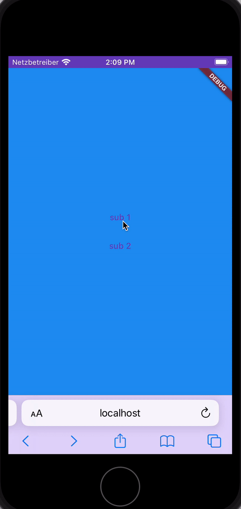

# Go router Safari swipe-to-back bug

## To reproduce the bug

1. Build and run as **target web**
2. Open a iPhone emulator, I used older iPhone SE (3rd Generation) with iOS 16.2
3. Open Safari one iPhone emulator
4. After Chrome is loaded with the app, copy the URL into the Safari browser of the iPhone emulator
   to show the app there
5. Navigate to a sub route
6. Swipe back: **Important:** Start swipe from left of the screen, **not** within the screen
7. Below page is shown twice. (See screenshot/gif)

### Expected behavior

Just the previous page is shown, without flickering or any animation triggered.

---

### Flutter doctor

    
flutter doctor -v

    [✓] Flutter (Channel stable, 3.13.6, on macOS 13.1 22C65 darwin-arm64, locale de-DE)
• Flutter version 3.13.6 on channel stable at /Users/daniel.riegler/Documents/flutter
• Upstream repository https://github.com/flutter/flutter.git
• Framework revision ead455963c (vor 2 Wochen), 2023-09-26 18:28:17 -0700
• Engine revision a794cf2681
• Dart version 3.1.3
• DevTools version 2.25.0

[✓] Android toolchain - develop for Android devices (Android SDK version 33.0.0)
• Android SDK at /Users/daniel.riegler/Library/Android/sdk
• Platform android-33, build-tools 33.0.0
• Java binary at: /Users/daniel.riegler/Library/Application
Support/JetBrains/Toolbox/apps/AndroidStudio/ch-0/223.8836.35.2231.10671973/Android
Studio.app/Contents/jbr/Contents/Home/bin/java
• Java version OpenJDK Runtime Environment (build 17.0.6+0-17.0.6b829.9-10027231)
• All Android licenses accepted.

[✓] Xcode - develop for iOS and macOS (Xcode 14.2)
• Xcode at /Applications/Xcode.app/Contents/Developer
• Build 14C18
• CocoaPods version 1.12.0

[✓] Chrome - develop for the web
• Chrome at /Applications/Google Chrome.app/Contents/MacOS/Google Chrome

[!] Android Studio (version unknown)
• Android Studio at /Users/daniel.riegler/Library/Application
Support/JetBrains/Toolbox/apps/AndroidStudio/ch-1/221.5921.22.2211.8881706/Android Studio
Preview.app/Contents
• Flutter plugin can be installed from:
🔨 https://plugins.jetbrains.com/plugin/9212-flutter
• Dart plugin can be installed from:
🔨 https://plugins.jetbrains.com/plugin/6351-dart
✗ Unable to determine Android Studio version.
• Java version OpenJDK Runtime Environment (build 11.0.13+0-b1751.21-8125866)

[!] Android Studio (version unknown)
• Android Studio at /Users/daniel.riegler/Library/Application
Support/JetBrains/Toolbox/apps/AndroidStudio/ch-1/221.6008.13.2211.8963757/Android Studio
Preview.app/Contents
• Flutter plugin can be installed from:
🔨 https://plugins.jetbrains.com/plugin/9212-flutter
• Dart plugin can be installed from:
🔨 https://plugins.jetbrains.com/plugin/6351-dart
✗ Unable to determine Android Studio version.
• Java version OpenJDK Runtime Environment (build 11.0.15+0-b2043.56-8887301)

[✓] Android Studio (version 2022.1)
• Android Studio at /Users/daniel.riegler/Library/Application
Support/JetBrains/Toolbox/apps/AndroidStudio/ch-0/221.6008.13.2211.9619390/Android
Studio.app/Contents
• Flutter plugin can be installed from:
🔨 https://plugins.jetbrains.com/plugin/9212-flutter
• Dart plugin can be installed from:
🔨 https://plugins.jetbrains.com/plugin/6351-dart
• Java version OpenJDK Runtime Environment (build 11.0.15+0-b2043.56-8887301)

[✓] Android Studio (version 2022.3)
• Android Studio at /Users/daniel.riegler/Library/Application
Support/JetBrains/Toolbox/apps/AndroidStudio/ch-0/223.8836.35.2231.10671973/Android
Studio.app/Contents
• Flutter plugin can be installed from:
🔨 https://plugins.jetbrains.com/plugin/9212-flutter
• Dart plugin can be installed from:
🔨 https://plugins.jetbrains.com/plugin/6351-dart
• Java version OpenJDK Runtime Environment (build 17.0.6+0-17.0.6b829.9-10027231)

[✓] IntelliJ IDEA Community Edition (version 2022.2.1)
• IntelliJ at /Users/daniel.riegler/Library/Application
Support/JetBrains/Toolbox/apps/IDEA-C/ch-0/222.3739.54/IntelliJ IDEA CE.app
• Flutter plugin can be installed from:
🔨 https://plugins.jetbrains.com/plugin/9212-flutter
• Dart plugin can be installed from:
🔨 https://plugins.jetbrains.com/plugin/6351-dart

[✓] IntelliJ IDEA Community Edition (version 2022.2.3)
• IntelliJ at /Users/daniel.riegler/Library/Application
Support/JetBrains/Toolbox/apps/IDEA-C/ch-0/222.4345.14/IntelliJ IDEA CE.app
• Flutter plugin can be installed from:
🔨 https://plugins.jetbrains.com/plugin/9212-flutter
• Dart plugin can be installed from:
🔨 https://plugins.jetbrains.com/plugin/6351-dart

[✓] VS Code (version 1.74.0)
• VS Code at /Users/daniel.riegler/Downloads/Visual Studio Code.app/Contents
• Flutter extension version 3.60.0

[✓] Connected device (3 available)
• iPhone SE (3rd generation) (mobile) • 25B44BCC-A96A-4FE2-98AB-88A6FB854209 • ios •
com.apple.CoreSimulator.SimRuntime.iOS-16-2 (simulator)
• macOS (desktop)                     • macos • darwin-arm64 • macOS 13.1 22C65 darwin-arm64
• Chrome (web)                        • chrome • web-javascript • Google Chrome 117.0.5938.149

[✓] Network resources
• All expected network resources are available.

! Doctor found issues in 2 categories.

